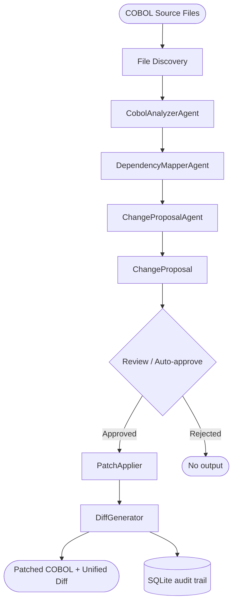

**Last updated**: 2026-03-16

# COBOL Safe Code Modification (CSCM)

CSCM is a parallel pipeline in the Legacy Modernization Framework that modifies COBOL source code **in place** — no transpilation to Java or C#. It targets organisations whose audit trails, regulatory certifications, or integration contracts are tied to COBOL artefacts deployed on IBM AS400/LPAR systems.

For the full feature specification see [cobol-safe-code-modification-spec.md](cobol-safe-code-modification-spec.md).

---

## Pipeline Overview



| Step | Name | Agent / Component | Output |
|------|------|-------------------|--------|
| 1 | File Discovery | `FileHelper` | Loads target `.cbl`/`.cob`/`.cobol`/`.cpy` from disk |
| 2 | Analysis | `CobolAnalyzerAgent` | `CobolAnalysis` (divisions, sections, paragraphs, variables) |
| 3 | Dependencies | `DependencyMapperAgent` | `DependencyMap` (CALL, COPY, SQL, CICS, file I/O) |
| 4 | Change Proposal | `ChangeProposalAgent` | `ChangeProposal` with paragraph-level replacement text, risk level, rationale |
| 5 | Patch & Diff | `PatchApplier` + `DiffGenerator` | Patched COBOL file + unified diff (deterministic, no LLM) |

Steps 1-4 always run. Step 5 only runs when `--propose-only` is **not** set and the proposal is approved.

---

## Two Modes

| Mode | Steps | Flag | Use case |
|------|-------|------|----------|
| **Propose only** | 1 → 2 → 3 → 4 | `--propose-only` | Review the proposal and diff in the portal before applying anything |
| **Full pipeline** | 1 → 2 → 3 → 4 → 5 | (default) | Analyze, propose, and apply the patch in one run |

---

## Quick Start (Linux / macOS)

```bash
./doctor.sh cscm
```

The interactive wizard walks through:

```
🔧 COBOL Safe Code Modification (CSCM)
========================================

Pipeline mode:
  [1] Propose only  — Analyze → Dependencies → Proposal  (review before patching)
  [2] Full pipeline  — Analyze → Dependencies → Proposal → Patch

Select mode (1-2) [default: 1]: 1
Mode: Propose only (steps 1-3, no patch)

Available COBOL files:
  [1] CUSTOMER-DISPLAY.cbl
  [2] CUSTOMER-INQUIRY.cbl

Select target file (1-2): 2
Target: CUSTOMER-INQUIRY.cbl

Change type:
  [1] BugFix
  [2] LogicUpdate
  [3] CompliancePatch
  [4] Performance

Select change type (1-4) [default: 1]: 1
Change type: BugFix

Scope — paragraph/section names allowed to be modified
Enter one or more names separated by spaces.
Scope: SEARCH-CUSTOMER

Rationale — why is this change needed?
Rationale: Display the searched customer ID in the error message

Speed Profile
======================================
  ...

🔧 Starting CSCM Pipeline...
==========================================
  Target:      CUSTOMER-INQUIRY.cbl
  Change type: BugFix
  Scope:       SEARCH-CUSTOMER
  Rationale:   Display the searched customer ID in the error message
==========================================
```

The portal launches automatically at http://localhost:5028 for reviewing proposals and diffs.

### Prerequisites

CSCM requires the same AI provider as the rest of the framework:

| Provider | Config required |
|----------|----------------|
| **GitHub Copilot SDK** | `AZURE_OPENAI_SERVICE_TYPE=GitHubCopilot` + `copilot login`. Run `./doctor.sh setup` and select "GitHub Copilot SDK". |
| **Azure OpenAI** | Endpoint + API key or `az login`. Set in `Config/ai-config.local.env`. |

**Neo4j is optional.** If Docker / Neo4j is not running you will see connection warnings in the logs — these are harmless. Dependency data is always saved to SQLite; Neo4j adds graph visualization in the portal.

**Portal chat works with both providers.** The portal picks up `AZURE_OPENAI_SERVICE_TYPE` from the environment — when set to `GitHubCopilot`, the chat panel uses `CopilotChatClient`. No Azure OpenAI / Foundry endpoint required.

**Portal:** `doctor.sh cscm` launches the portal automatically. When using `dotnet run` directly, start the portal separately:

```bash
# In a separate terminal
./doctor.sh portal            # or: dotnet run --project McpChatWeb
# Portal opens at http://localhost:5028
```

---

## CLI Usage (PowerShell / direct)

### Propose only (steps 1-4, no patch)

```powershell
$env:AZURE_OPENAI_SERVICE_TYPE = "GitHubCopilot"
dotnet run -- cscm `
  --source ./source `
  --target-file CUSTOMER-INQUIRY.cbl `
  --change-type BugFix `
  --scope SEARCH-CUSTOMER `
  --rationale "Display the searched customer ID in the error message" `
  --propose-only
```

### Full pipeline (steps 1-5, auto-approve low-risk)

```powershell
dotnet run -- cscm `
  --source ./source `
  --target-file CUSTOMER-INQUIRY.cbl `
  --change-type BugFix `
  --scope SEARCH-CUSTOMER `
  --rationale "Display the searched customer ID in the error message" `
  --output ./output/cscm `
  --auto-approve-low-risk
```

### Bash equivalent

```bash
export AZURE_OPENAI_SERVICE_TYPE=GitHubCopilot
dotnet run -- cscm \
  --source ./source \
  --target-file CUSTOMER-INQUIRY.cbl \
  --change-type BugFix \
  --scope SEARCH-CUSTOMER \
  --rationale "Display the searched customer ID in the error message" \
  --propose-only
```

### Options

| Option | Alias | Required | Default | Description |
|---|---|---|---|---|
| `--source` | `-s` | Yes | — | Path to folder containing COBOL source files |
| `--target-file` | `-t` | Yes | — | COBOL file name to modify (e.g. `CUSTOMER-INQUIRY.cbl`) |
| `--change-type` | `-ct` | No | `BugFix` | `BugFix`, `LogicUpdate`, `CompliancePatch`, or `Performance` |
| `--scope` | `-sc` | Yes | — | Paragraph/section names allowed to be modified (repeatable) |
| `--rationale` | `-r` | Yes | — | Free-text description of why the change is needed |
| `--output` | `-o` | No | `output/cscm` | Folder for patched files and diffs |
| `--config` | `-c` | No | `Config/appsettings.json` | Path to configuration file |
| `--propose-only` | — | No | `false` | Run steps 1-4 only. Skip patch application. |
| `--auto-approve-low-risk` | — | No | `false` | Auto-approve and apply proposals where `RiskLevel = Low` |

---

## Components

### Models

| File | Purpose |
|---|---|
| `Models/ChangeRequest.cs` | Input: change type, scope (paragraph names), rationale, target file |
| `Models/ChangeProposal.cs` | Output: affected paragraphs with original/proposed text, risk level, approval state, impacted programs |

### Agent

| File | Purpose |
|---|---|
| `Agents/ChangeProposalAgent.cs` | Inherits `AgentBase`. Dual-API (Responses API + `IChatClient`). Proposes paragraph-level COBOL modifications scoped to the declared paragraph list. |
| `Agents/Prompts/ChangeProposalAgent.md` | Prompt template with `System` and `User` sections. Instructs the model to act as a conservative COBOL reviewer and return structured JSON. |
| `Agents/Interfaces/IChangeProposalAgent.cs` | Interface: `ProposeChangesAsync(ChangeRequest, CobolFile, CobolAnalysis, DependencyMap?, BusinessLogic?)` |

### Helpers

| File | Purpose |
|---|---|
| `Helpers/DiffGenerator.cs` | Static `GenerateUnifiedDiff()` — LCS-based algorithm producing `---`/`+++` unified diffs. No LLM involved. |
| `Helpers/PatchApplier.cs` | `Apply()` — deterministic paragraph-level text substitution with scope enforcement. Returns `PatchResult`. |

### Process

| File | Purpose |
|---|---|
| `Processes/CscmProcess.cs` | Top-level orchestrator (analogous to `ReverseEngineeringProcess`). Wires the pipeline steps, persists results, handles auto-approval and propose-only logic. |

### Persistence

Two new tables added to `SqliteMigrationRepository.InitializeAsync()`:

- **`cscm_proposals`** — run ID, source file, change type, scope, risk level, approval state, model used.
- **`cscm_diffs`** — foreign key to proposal, paragraph name, original text, proposed text, unified diff, patch-applied flag, revert snapshot.

---

## Safety Mechanisms

- **Scope enforcement** — The agent and `PatchApplier` both reject modifications outside the declared paragraph list.
- **Risk classification** — Every proposal receives a `RiskLevel` (Low / Medium / High). Only Low-risk proposals can be auto-approved.
- **Approval gate** — Proposals default to `Pending`. Patch application requires explicit approval or the `--auto-approve-low-risk` flag.
- **Propose-only mode** — Default in `doctor.sh`. Run steps 1-4 to review proposal and diff before committing to any file changes.
- **Revert snapshot** — `cscm_diffs.revert_snapshot` stores the original paragraph text, enabling one-step rollback without re-running analysis.
- **Deterministic patching** — `PatchApplier` and `DiffGenerator` contain no LLM calls; they operate on exact text matches.

---

## Configuration

CSCM reuses the existing `Config/appsettings.json` AI settings — no new configuration keys are required. The `ChangeProposalAgent` uses the same model deployment as `CobolAnalyzerAgent` (`AISettings.CobolAnalyzerModelId`).

Chunking settings (`ChunkingSettings.MaxLinesPerChunk`, `MaxTokensPerChunk`) apply unchanged for large programs.

---

## What Is Not Yet Implemented

The following items from the spec are deferred to later phases:

- **`CscmChunkedProcess`** — large-file variant using `ChunkingOrchestrator` for programs ≥ 150K chars / ≥ 3K lines.
- **MCP resource endpoints** — `insights://runs/{id}/cscm-proposals` for portal-based review.
- **Neo4j ripple-effect detection** — traversing `DEPENDS_ON` edges to identify upstream/downstream impact.
- **`cobol-as400-safe-mod` generation profile** in `GenerationProfiles.json`.
- **Multi-file batch mode** — processing multiple COBOL files in a single run.
