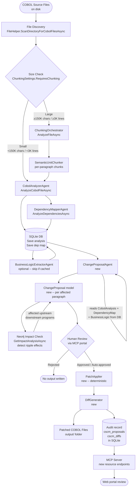

**Last updated**: 2026-03-16

# COBOL Safe Code Modification (CSCM) — Feature Specification

---

## Table of Contents

1. [Overview](#1-overview)
2. [Reusable Building Blocks](#2-reusable-building-blocks)
3. [Proposed Architecture](#3-proposed-architecture)
4. [Safety Mechanisms](#4-safety-mechanisms)
5. [LLM Context Window Requirements](#5-llm-context-window-requirements)
6. [Implementation Roadmap](#6-implementation-roadmap)
7. [Open Questions](#7-open-questions)

---

## 1. Overview

### 1.1 Problem Statement

The existing framework converts COBOL to Java or C#. Many organisations running IBM AS400/LPAR workloads, however, cannot migrate to a new language: their audit trails, operational certifications, regulatory approvals, or integration contracts are tied to COBOL source artefacts. What they need is the ability to modify COBOL *in place*: fix logic defects, apply compliance patches, remove obsolete sections, improve data-structure layouts, or update hard-coded thresholds — while keeping the output language as COBOL and keeping the modified code deployable to the same IBM AS400/LPAR system.

COBOL Safe Code Modification (CSCM) addresses this gap. It uses the same analysis, chunking, dependency-mapping, and agent infrastructure already in this repository — but changes the objective from *transpilation* to *safe, traceable, targeted in-language patching*.

### 1.2 Scope Boundaries

**In scope:**
- Accepting COBOL `.cbl`, `.cob`, `.cobol`, and `.cpy` source files as input (already available locally on disk).
- Deep structural analysis of the program using the existing `CobolAnalyzerAgent` and `DependencyMapperAgent`.
- Producing a `ChangeProposal` — a structured description of what to change and why — before any modification is written.
- Generating a patched COBOL file as the primary output (output language is COBOL, not Java or C#).
- Diff generation (unified diff format) showing original vs. proposed changes for human review.
- Persisting the original source, the proposal, the diff, free-text rationale, and the approval state in the existing SQLite database.
- Optionally enriching the dependency graph in Neo4j with affected-paragraph relationships.
- Reusing the `ChunkingOrchestrator` to process programs that exceed the context-window threshold (same thresholds as today: ≥ 150,000 chars or ≥ 3,000 lines).
- Integrating with the existing MCP server and web portal for review and approval of proposed changes.

**Explicitly out of scope:**
- Reading from or writing to the IBM AS400/LPAR system (no IFS, FTP, SAVF, or QSYS access). Files are assumed to be available locally; deployment back to the system is the operator's responsibility.
- Compiling, running, or syntax-validating the patched COBOL output on any platform (the framework does not include a COBOL compiler).
- Transpilation to another language (CSCM output is always COBOL).
- The existing migration pipeline (`MigrationProcess`, `ChunkedMigrationProcess`, converters) — CSCM is a parallel, independent pipeline.
- Unit test generation for modified COBOL programs.
- Real-time AS400 job monitoring or message-queue integration.

---

## 2. Reusable Building Blocks

### 2.1 Agents — Reusable as-is or with minor adaptation

| Component | File | Role in CSCM | Adaptation needed |
|---|---|---|---|
| `CobolAnalyzerAgent` | `Agents/CobolAnalyzerAgent.cs` | Phase 1 — produces `CobolAnalysis` (paragraphs, variables, divisions, raw analysis text) for the input file | None. Already reads COBOL, returns structured `CobolAnalysis`. |
| `DependencyMapperAgent` | `Agents/DependencyMapperAgent.cs` | Phase 2 — builds `DependencyMap` including COPY, CALL, SQL, CICS, file I/O relationships and the Mermaid graph | None for map generation; the Neo4j enrichment is optional as in other pipelines. |
| `BusinessLogicExtractorAgent` | `Agents/BusinessLogicExtractorAgent.cs` | Optional Phase 1b — extracts `BusinessLogic` (user stories, features, business rules) to provide semantic context to the change planner | None. Can be invoked for programs where business context is not yet in the DB. |
| `AgentBase` | `Agents/Infrastructure/AgentBase.cs` | `ChangeProposalAgent` (new) will inherit from this | Minor: new prompt sections; the entire dual-API fallback, reasoning-exhaustion escalation, rate-limiting, and retry logic (`ExecuteWithFallbackAsync`) are inherited. |
| `ChatClientFactory` | `Agents/Infrastructure/ChatClientFactory.cs` | Creates `IChatClient` or `ResponsesApiClient` for the new agent | None. |
| `CopilotChatClient` | `Agents/Infrastructure/CopilotChatClient.cs` | GitHub Copilot provider for prototype phase | None. |
| `ResponsesApiClient` | `Agents/Infrastructure/ResponsesApiClient.cs` | Azure OpenAI Responses API route (codex models); includes `EstimateTokens()`, complexity scoring, reasoning-exhaustion handling | None. CSCM reuses the same token estimation and complexity scoring to size its requests. |

### 2.2 Chunking Pipeline — Reusable directly

| Component | File | Role in CSCM |
|---|---|---|
| `ChunkingOrchestrator` | `Chunking/ChunkingOrchestrator.cs` | For programs ≥ 150,000 chars or ≥ 3,000 lines, splits the COBOL source into semantic chunks that can each fit within the model context window. Manages resumability, parallel processing, and reconciliation. |
| `CobolAdapter` | `Chunking/Adapters/CobolAdapter.cs` | Identifies COBOL semantic units (divisions, sections, paragraphs, copybook includes); provides `IdentifySemanticUnitsAsync()`, variable extraction, call-dependency extraction. |
| `SemanticUnitChunker` | `Chunking/Core/SemanticUnitChunker.cs` | Splits at semantic boundaries where possible; falls back to line-based chunking for oversized or boundary-ambiguous programs. |
| `ChunkContextManager` | `Chunking/Context/ChunkContextManager.cs` | Maintains per-chunk context: prior signatures, type mappings, compressed history, forward references. CSCM repurposes this to maintain paragraph-context across modification chunks. |
| `SignatureRegistry` | `Chunking/Core/SignatureRegistry.cs` | Tracks paragraph/section identities across chunks. Prevents duplicate modification proposals for the same paragraph. |
| `ConversionValidator` | `Chunking/Validation/ConversionValidator.cs` | Validates consistency of modifications across chunk boundaries. CSCM uses `ReconcileFileAsync()` to check that a patched paragraph does not leave unresolved cross-references. |
| `TokenHelper` | `Helpers/TokenHelper.cs` | `EstimateCobolTokens()` (chars ÷ 3.0) and `TruncateCobolIntelligently()` (40% start + 50% end with COBOL comment for omitted middle). Used for pre-flight context-window checks. |

### 2.3 Persistence Layer — Reusable and extended

| Component | Role in CSCM | Adaptation needed |
|---|---|---|
| `IMigrationRepository` / `HybridMigrationRepository` | Stores `CobolAnalysis`, `DependencyMap`, `BusinessLogic` which CSCM reads at Phase 1 rather than recomputing. | None for reads. Two new tables needed (see §4.4). |
| `SqliteMigrationRepository` | Primary persistence. `SaveCobolFilesAsync`, `SaveAnalysesAsync`, `SaveDependencyMapAsync` are reused. Two new tables (`cscm_proposals`, `cscm_diffs`) are added via migration script — no changes to existing DDL. | Add `InitializeCscmTablesAsync()` method or a schema-migration step. |
| `Neo4jMigrationRepository` | Optional ripple-effect detection: `GetImpactAnalysisAsync(runId, fileName)` traverses `DEPENDS_ON` edges to depth 5, returning upstream and downstream affected programs. | None. Used read-only in CSCM. |

### 2.4 MCP Server — Reusable, new resources added

| Component | Role in CSCM | Adaptation needed |
|---|---|---|
| `McpServer` | `resources/read` and `messages/create` (AI Q&A) allow portal users to review change proposals and ask questions. | Add two new resource URI patterns (see §2.6); extend `HandleResourceReadAsync()`. |
| `RunMcpServerProcess` | Legacy process; not used by CSCM. | Not used. |

### 2.5 Configuration — Reusable directly

| Component | Role in CSCM |
|---|---|
| `ModelProfileSettings` (`CodexProfile`) | Controls reasoning effort, output token limits (32,768–100,000), timeout (900 s), and complexity thresholds. All settings apply unchanged to the new `ChangeProposalAgent`. |
| `ChunkingSettings` | Chunking thresholds (150,000 chars / 3,000 lines) apply directly. CSCM adds no new chunking parameters. |
| `GenerationProfiles.json` | The existing `quarkus-java-17` and `dotnet-8-filescoped` profiles are not used. CSCM will add a new `cobol-as400-safe-mod` profile in a later phase. |
| `PromptLoader` | Loads prompt templates by agent name and section name from `Agents/Prompts/`. CSCM adds one new file: `Agents/Prompts/ChangeProposalAgent.md`. |

### 2.6 MCP Resources — New endpoints required

Two new resource URI patterns must be registered in `McpServer.HandleResourcesListAsync()` and `HandleResourceReadAsync()`:

| URI Pattern | MIME | Description |
|---|---|---|
| `insights://runs/{id}/cscm-proposals` | `application/json` | List of all change proposals in this run |
| `insights://runs/{id}/cscm-proposals/<filename>` | `application/json` | Full proposal + diff + approval state for a single file |

### 2.7 Genuine Gaps — Must be built new

| Gap | Reason |
|---|---|
| `ChangeProposalAgent` | No existing agent proposes COBOL patches. The converter agents produce Java/C#. This is a new agent inheriting `AgentBase`, with new prompt templates. |
| `ChangeRequest` model | A structured input model describing the change objective: type (bug-fix / logic-update / compliance-patch / performance), scope (paragraph names, line ranges, keywords), rationale. |
| `ChangeProposal` model | The structured output of `ChangeProposalAgent`: affected paragraphs, proposed COBOL replacement text for each, rationale, risk level, list of potentially impacted paragraphs derived from dep graph. |
| `PatchApplier` | A deterministic (non-AI) component that applies accepted `ChangeProposal` entries to the original COBOL source text. Operates at the paragraph/section boundary level. Does not invoke any LLM. |
| `DiffGenerator` | Produces a unified diff (`---`/`+++`) between original and patched COBOL. Can use `System.Text` line comparisons; no external diff tool required. |
| `CscmProcess` | Top-level orchestration process analogous to `ReverseEngineeringProcess`. Wires all phases from ingest through to patched-file output and audit record write. |
| `CscmChunkedProcess` | Large-file variant analogous to `ChunkedReverseEngineeringProcess`. Uses `ChunkingOrchestrator` to feed chunks to `ChangeProposalAgent`. |
| SQLite schema additions | Two new tables: `cscm_proposals` and `cscm_diffs` (see §4.4). |
| New `cscm` CLI verb | Registered in `Program.cs` alongside existing `reverse-engineer`, `mcp`, `conversation`. |
| `Agents/Prompts/ChangeProposalAgent.md` | Prompt template for the new agent (System + User sections). |

---

## 3. Proposed Architecture

### 3.1 End-to-End Pipeline Diagram



### 3.2 How ChunkingOrchestrator and CobolAnalyzerAgent Are Wired In

For **small files** (below the threshold), `CscmProcess` calls `CobolAnalyzerAgent.AnalyzeCobolFileAsync()` directly, identical to how `ReverseEngineeringProcess` does it today.

For **large files**, `CscmChunkedProcess` calls `ChunkingOrchestrator.AnalyzeFileAsync()` to obtain a `ChunkingPlan`, then calls `ChunkingOrchestrator.ProcessChunksAsync()` — but passes a delegate that invokes `ChangeProposalAgent.ProposeChangesForChunkAsync()` instead of a converter. After processing, the cross-chunk reconciliation pass (`ConversionValidator.ReconcileFileAsync()`) verifies that no proposed patch introduces an unresolved cross-reference.

Both processes delegate `DependencyMapperAgent.AnalyzeDependenciesAsync()` before invoking the `ChangeProposalAgent`, so the agent always has access to a populated `DependencyMap` when generating proposals.

### 3.3 How ChangeProposalAgent Differs from Converter Agents

| Dimension | Converter Agents (existing) | ChangeProposalAgent (new) |
|---|---|---|
| **Output language** | Java or C# | COBOL (same as input) |
| **Output type** | Whole-file transpiled code | Scoped replacement snippets per affected paragraph |
| **Prompt objective** | "Translate this COBOL into idiomatic Java/C#" | "Given this change request and analysis, produce the minimal COBOL edit that achieves the objective without changing surrounding behaviour" |
| **Structural output** | `JavaFile` / `CodeFile` (free-form code string) | `ChangeProposal` (structured: affected paragraphs, replacement text, rationale, risk, affected dependencies) |
| **Safety gate** | None — converter output is written immediately | Proposal is written to DB; flagged for human review; `PatchApplier` only runs after approval |
| **Scope constraint** | Whole file or whole chunk | Limited to named paragraphs/sections in the `ChangeRequest`; explicitly forbidden from modifying data-division layouts unless the request includes a data-division scope |
| **Dependency awareness** | Dependency context is informational only | Must not propose changes to a paragraph if the dependency graph shows callers outside the stated scope, unless risk is explicitly elevated |
| **Inherits from** | `AgentBase` | `AgentBase` (same dual-API, fallback, rate-limit, exhaustion-escalation logic) |

The `ChangeProposalAgent` prompt template (`Agents/Prompts/ChangeProposalAgent.md`) will contain:

- **System section**: Role as a conservative IBM COBOL/RPG reviewer, change minimisation doctrine, scope enforcement rules, structured JSON output schema for `ChangeProposal`.
- **User section**: Placeholders `{{ChangeRequestType}}`, `{{ChangeRequestScope}}`, `{{ChangeRequestRationale}}`, `{{CobolContent}}`, `{{AnalysisSummary}}`, `{{DependencyContext}}`, `{{AffectedParagraphs}}`.

---

## 4. Safety Mechanisms

### 4.1 Scope Enforcement — Paragraph-Level Containment

The `ChangeRequest` model must include an explicit `Scope` field enumerating the paragraph and/or section names that are allowed to be modified. The `ChangeProposalAgent` system prompt instructs the model to return a structured error (not a proposal) if achieving the requested change requires modifying paragraphs outside the declared scope.

The `PatchApplier` performs a secondary enforcement check: it compares each proposed replacement in the `ChangeProposal` against the `Scope` allow-list before writing any bytes. Any out-of-scope replacement is rejected and logged, even if the LLM produced it.

### 4.2 Dependency Graph Ripple-Effect Detection

Before the `ChangeProposalAgent` generates a proposal, `CscmProcess` calls `Neo4jMigrationRepository.GetImpactAnalysisAsync(runId, fileName)`. This traverses `DEPENDS_ON` edges up to depth 5, returning the list of programs that call into, or are called by, each in-scope paragraph.

The result is serialised into the `{{DependencyContext}}` prompt placeholder. The agent is instructed to flag any proposed change as `RiskLevel = High` if the impact analysis returns callers in programs outside the current `ChangeRequest` scope.

When Neo4j is not available (disabled in `ApplicationSettings.Neo4j.Enabled`), ripple-effect detection falls back to the static `DependencyMap.Dependencies` list stored in SQLite (via `SqliteMigrationRepository.GetDependenciesAsync()`), which covers direct one-hop relationships. A warning is logged that multi-hop propagation is unavailable.

### 4.3 Diff and Review Gate

The `PatchApplier` does not write output files without an explicit approval signal. The flow is:

1. `ChangeProposalAgent` returns a `ChangeProposal` with `ApprovalState = Pending`.
2. `CscmProcess` persists the proposal (and the unified diff) to `cscm_proposals` and `cscm_diffs`.
3. In interactive mode (CLI or portal), the diff is displayed and the operator must enter an explicit approval.
4. In batch/unattended mode, only proposals with `RiskLevel = Low` are auto-approved; `Medium` and `High` proposals remain in `Pending` state and must be approved before the next run can apply them.
5. `PatchApplier` reads only `ApprovalState = Approved` proposals from the DB before writing files.

### 4.4 Audit Trail — Persistence Schema

Two new tables are added to the SQLite database (additive migration, no existing tables modified):

#### `cscm_proposals`

```sql
CREATE TABLE IF NOT EXISTS cscm_proposals (
    id               INTEGER PRIMARY KEY AUTOINCREMENT,
    run_id           INTEGER NOT NULL,
    source_file      TEXT NOT NULL,
    change_type      TEXT NOT NULL,           -- bug-fix | logic-update | compliance-patch | performance
    requested_scope  TEXT NOT NULL,           -- JSON array of paragraph/section names
    rationale        TEXT NOT NULL,
    affected_paragraphs TEXT NOT NULL,        -- JSON array of actually-proposed paragraph names
    risk_level       TEXT NOT NULL,           -- Low | Medium | High
    approval_state   TEXT NOT NULL DEFAULT 'Pending', -- Pending | Approved | Rejected
    approved_by      TEXT,
    approved_at      DATETIME,
    model_used       TEXT NOT NULL,
    created_at       DATETIME NOT NULL DEFAULT CURRENT_TIMESTAMP,
    UNIQUE(run_id, source_file, change_type, created_at)
);
```

#### `cscm_diffs`

```sql
CREATE TABLE IF NOT EXISTS cscm_diffs (
    id               INTEGER PRIMARY KEY AUTOINCREMENT,
    proposal_id      INTEGER NOT NULL REFERENCES cscm_proposals(id),
    paragraph_name   TEXT NOT NULL,
    original_text    TEXT NOT NULL,
    proposed_text    TEXT NOT NULL,
    unified_diff     TEXT NOT NULL,           -- unified diff format (---/+++ lines)
    patch_applied    INTEGER NOT NULL DEFAULT 0,  -- 0 = not applied, 1 = applied
    applied_at       DATETIME,
    revert_snapshot  TEXT                     -- original_text copy for one-step revert
);
CREATE INDEX IF NOT EXISTS idx_cscm_diffs_proposal ON cscm_diffs(proposal_id);
```

**What is stored per change:**
- Original source text of each affected paragraph (`revert_snapshot` enables one-step revert without re-running analysis).
- Proposed replacement text.
- Unified diff for human review.
- Identity of the model and run that produced the proposal.
- Explicit approval record (who, when, or system auto-approval with risk-level recorded).

---

## 5. LLM Context Window Requirements

### 5.1 COBOL Token Estimation

The project already provides two verified token estimators, cross-checked against each other:

| Estimator | Formula | Source |
|---|---|---|
| `TokenHelper.EstimateCobolTokens()` | `tokens = ceil(chars / 3.0)` | `Helpers/TokenHelper.cs` — specifically uses 3.0 for COBOL (vs 3.5 general) because COBOL has denser whitespace and fixed-column formatting |
| `ResponsesApiClient.EstimateTokens()` | `tokens = ceil(chars / 3.5)` | `Agents/Infrastructure/ResponsesApiClient.cs` — general-purpose, does not distinguish COBOL |
| `doc/smart-chunking-architecture.md` (documented) | COBOL: `chars / 3.0`; general: `chars / 3.5` | Confirms `TokenHelper` is the authoritative COBOL estimator |
| `SemanticUnitChunker` constant | `CharsPerToken = 4` | `Chunking/Core/SemanticUnitChunker.cs` — conservative (larger token estimate per char) used for chunk boundary decisions |

For CSCM planning purposes, the recommended formula is:

```
COBOL tokens ≈ LOC × avg_chars_per_line / 3.0
```

A typical COBOL source line is approximately **40–60 characters** (fixed column positions 7–72 = 66 chars max; practical average ~48 chars including inline comments, blank lines, and dividers). Using 48 chars/line:

```
tokens ≈ LOC × 48 / 3.0  →  tokens ≈ LOC × 16
```

For conservative planning (accounting for verbose copybooks, embedded SQL blocks, and long PIC clauses), use:

```
tokens ≈ LOC × 20   (conservative upper bound)
```

This is consistent with the chunking settings: the auto-chunk line threshold is 3,000 lines and the `MaxTokensPerChunk` is 28,000, which implies ~9.3 tokens/line at the chunk boundary — but that is after stripping whitespace-only lines. The `ResponsesApiClient.NoiseLineRegex` strips blank/comment/directive lines before scoring, effectively raising tokens-per-meaningful-line. The 20-token/LOC figure covers full source LOC including noise lines and is the correct figure for context-window budgeting.

### 5.2 COBOL Program Size to Context Window Matrix

The table below uses `tokens ≈ LOC × 20` (conservative) to estimate total program token size, then adds 20% overhead for the analysis context (structured `CobolAnalysis` JSON, `DependencyMap` summary, and the change request) and 15% for the proposed diff output.

| Size Tier | LOC Range | Program tokens (est.) | Analysis context overhead (+20%) | Proposed diff output (+15%) | **Minimum context needed** | **Recommended window** |
|---|---|---|---|---|---|---|
| Small | < 500 LOC | < 10,000 | 2,000 | 1,500 | **< 14,000 tokens** | 32K (leaves headroom for reasoning) |
| Medium | 500 – 5,000 LOC | 10,000 – 100,000 | 2,000 – 20,000 | 1,500 – 15,000 | **14,000 – 135,000 tokens** | 128K–200K; chunking required for upper half |
| Large | 5,000 – 50,000 LOC | 100,000 – 1,000,000 | 20,000 – 200,000 | 15,000 – 150,000 | **> 135,000 tokens** | Chunking always required; 128K window operates on ~6,000 LOC per chunk |
| Enterprise | > 50,000 LOC | > 1,000,000 | > 200,000 | > 150,000 | **>> 1M tokens** | Chunking required; 1M+ window enables processing entire large programs without chunk stitching |

The project's current chunk settings (`MaxLinesPerChunk = 1500`, `MaxTokensPerChunk = 28,000`) mean each chunk represents approximately 1,500 LOC / ~30,000 tokens — well within any model's context window. CSCM can reuse these settings without modification.

### 5.3 Model Context Window Verification

Context window sizes are taken directly from the **GitHub Copilot model picker in VS Code** (observed 2026-03-16). This is the authoritative source for context limits as exposed to `CopilotChatClient`; limits shown here apply when `AISettings.ServiceType = "GitHubCopilot"`. Azure OpenAI deployment limits may differ and must be verified in Azure OpenAI Studio.

Columns: **LOC (no chunking)** = max COBOL lines processable in a single call using `tokens ≈ LOC × 20`.

#### GPT family — confirmed via GitHub Copilot model picker

| Model (Copilot display name) | Context window | LOC (no chunking) | Sufficient for size tier | Notes |
|---|---|---|---|---|
| GPT-5.1-Codex-Mini (Preview) ⚠ | **256K** | ~12,800 LOC | Small + Medium | Maps to `gpt-5.1-codex-mini` in `appsettings.json`. Preview; warning indicator shown in picker. |
| GPT-5.1-Codex ⚠ | **256K** | ~12,800 LOC | Small + Medium | Maps to `gpt-5.1-codex`. Preview. |
| GPT-5.1-Codex-Max ⚠ | **256K** | ~12,800 LOC | Small + Medium | Maps to `gpt-5.1-codex-max`. Preview. |
| GPT-5.1 | **192K** | ~9,600 LOC | Small + lower-Medium | — |
| GPT-5 mini | **192K** | ~9,600 LOC | Small + lower-Medium | — |
| GPT-5.2 | **400K** | ~20,000 LOC | Small + Medium + lower-Large | Maps to `gpt-5.2-chat` deployment in `appsettings.json`. Best available GPT window for CSCM without chunking. |
| GPT-5.2-Codex | **400K** | ~20,000 LOC | Small + Medium + lower-Large | — |
| GPT-5.3-Codex | **400K** | ~20,000 LOC | Small + Medium + lower-Large | — |
| GPT-5.4 | **400K** | ~20,000 LOC | Small + Medium + lower-Large | — |
| GPT-4.1 | **128K** | ~6,400 LOC | Small + lower-Medium | — |
| GPT-4o | **68K** | ~3,400 LOC | Small only | Copilot-exposed window is 68K, lower than the raw OpenAI API (128K). Use chunking for any program above ~3,400 LOC when using this model via Copilot. |

#### Claude family — confirmed via GitHub Copilot model picker

| Model (Copilot display name) | Context window | LOC (no chunking) | Sufficient for size tier | Notes |
|---|---|---|---|---|
| Claude Sonnet 4 | **144K** | ~7,200 LOC | Small + lower-Medium | This is the model referenced as `claude-sonnet-4` in the original spec draft; **not** 200K. |
| Claude Sonnet 4.5 | **200K** | ~10,000 LOC | Small + Medium | — |
| Claude Sonnet 4.6 | **200K** | ~10,000 LOC | Small + Medium | — |
| Claude Haiku 4.5 | **200K** | ~10,000 LOC | Small + Medium | Lowest cost multiplier (0.33×); suitable for high-volume analysis passes. |
| Claude Opus 4.5 | **200K** | ~10,000 LOC | Small + Medium | Highest quality; 3× cost multiplier. |
| Claude Opus 4.6 | **200K** | ~10,000 LOC | Small + Medium | Highest quality; 3× cost multiplier. |

#### Gemini family — confirmed via GitHub Copilot model picker

Gemini models are available directly via the Copilot provider (`CopilotChatClient`), removing the need for a separate Google AI provider extension.

| Model (Copilot display name) | Context window | LOC (no chunking) | Sufficient for size tier | Notes |
|---|---|---|---|---|
| Gemini 2.5 Pro | **173K** | ~8,650 LOC | Small + Medium | — |
| Gemini 3 Flash (Preview) | **173K** | ~8,650 LOC | Small + Medium | 0.33× cost multiplier. |
| Gemini 3 Pro (Preview) | **200K** | ~10,000 LOC | Small + Medium | — |
| Gemini 3.1 Pro (Preview) | **200K** | ~10,000 LOC | Small + Medium | — |

#### Other models — confirmed via GitHub Copilot model picker

| Model (Copilot display name) | Context window | LOC (no chunking) | Notes |
|---|---|---|---|
| MiniMax M2.5 (Preview) | **362K** | ~18,100 LOC | Tools only (no Vision). |
| MiniMax M2.5 (Copilot) (Preview) | **362K** | ~18,100 LOC | Tools only. |
| Goldeneye (Internal Only) | **400K** | ~20,000 LOC | Internal model; not available to external teams. |

#### Azure AI Foundry models (reachable via `ServiceType = "AzureOpenAI"` endpoint)

These limits are from public vendor documentation; they may differ from the Copilot-exposed limits above.

| Model | Confirmed context window | LOC (no chunking) | Notes |
|---|---|---|---|
| Phi-4 (Microsoft) | 16,384 tokens | ~820 LOC | Insufficient for most COBOL programs without aggressive chunking. Not recommended for CSCM. |
| Mistral Large 2 | 128,000 tokens | ~6,400 LOC | Small + lower-Medium tier. |
| Llama 3.1 405B | 128,000 tokens | ~6,400 LOC | Small + lower-Medium tier. |
| Llama 3.3 70B | 128,000 tokens | ~6,400 LOC | Small + lower-Medium tier. |

### 5.4 Context Window Recommendation Matrix

#### Prototype phase (GitHub Copilot provider, `ServiceType = "GitHubCopilot"`)

Context window sizes in this table are verified from the VS Code Copilot model picker (2026-03-16). **LOC thresholds** are derived from `tokens ≈ LOC × 20`.

| Program size tier | Recommended model | Context | Max LOC (no chunking) | Chunking required? | `ContextWindowSize` config |
|---|---|---|---|---|---|
| Small (< 500 LOC) | GPT-5.1-Codex-Mini (Preview) | 256K | ~12,800 | No | 256000 |
| Medium lower (500–5,000 LOC) | GPT-5.1-Codex or GPT-5.1-Codex-Max | 256K | ~12,800 | No | 256000 |
| Medium upper (5,000–10,000 LOC) | GPT-5.2 / GPT-5.2-Codex / GPT-5.4 | 400K | ~20,000 | No (for ≤ 20K LOC) | 400000 |
| Large (10,000–20,000 LOC) | GPT-5.2 / GPT-5.2-Codex / GPT-5.4 | 400K | ~20,000 | Chunking if > 20K LOC | 400000 |
| Large / Enterprise (> 20,000 LOC) | Any 400K model + chunking | 400K | ~20,000/chunk | Yes | 400000 |

The existing `Program.cs::ConfigureSmartChunking()` automatically promotes `AutoChunkLineThreshold` to 25,000 lines and `AutoChunkCharThreshold` to 400,000 chars when `AISettings.ContextWindowSize >= 100,000`. Setting `ContextWindowSize` to the model's confirmed context limit is the only configuration step required.

**Important:** GPT-4o is exposed at only **68K** tokens via the Copilot provider (vs 128K via the raw OpenAI API). Do not use `gpt-4o` via Copilot for COBOL programs larger than ~3,400 LOC without enabling chunking.

**Claude Sonnet 4** has a confirmed window of **144K** (not 200K) via Copilot. For programs up to ~7,200 LOC it avoids chunking; above that, prefer Claude Sonnet 4.5/4.6 (200K) or a GPT-5.x model.

#### Production phase (Azure AI Foundry provider, `ServiceType = "AzureOpenAI"`)

The codex deployment names in `appsettings.json` (`gpt-5.1-codex-mini`, `gpt-5.1-codex`, `gpt-5.2-chat`) match the Copilot-verified model identities. Apply the same confirmed context limits when configuring the Azure OpenAI endpoint.

| Program size tier | Recommended deployment | Confirmed context | Why |
|---|---|---|---|
| Small (< 500 LOC) | `gpt-5.1-codex-mini` | 256K | Fast, low cost (0.33× multiplier); well within context for all small programs. |
| Medium (500–12,800 LOC) | `gpt-5.1-codex` or `gpt-5.1-codex-max` | 256K | Full medium tier fits in a single call; no chunking overhead. |
| Large (12,800–20,000 LOC) | `gpt-5.2-codex` or `gpt-5.3-codex` or `gpt-5.4` | 400K | Covers lower-large tier without chunking; reduces API call count vs 256K models. |
| Large / Enterprise (> 20,000 LOC) | Any 400K model + chunking | 400K | No model in the verified list exceeds 400K via Copilot or Azure OpenAI. The existing `ChunkingOrchestrator` handles the remainder. |

**Token limit configuration (production):**
- Set `AISettings.ContextWindowSize` to the confirmed limit: `256000` for codex-mini/codex/codex-max; `400000` for GPT-5.2/5.3/5.4 deployments.
- `Program.cs::ConfigureSmartChunking()` will automatically adjust chunking thresholds.
- `CodexProfile.MaxOutputTokens = 100000` (current config) is sufficient for change proposals; the analysis + diff output is much smaller than a full code transpilation.

---

## 6. Implementation Roadmap

### Phase 1 — GitHub Copilot Prototype

**Goal:** Validate the change-proposal loop end-to-end with minimal new code; reuse the existing provider and DB infrastructure.

**New files to create:**

| File | Purpose |
|---|---|
| `Agents/ChangeProposalAgent.cs` | Inherits `AgentBase`; implements `IChangeProposalAgent`; calls `ExecuteWithFallbackAsync`; parses structured JSON `ChangeProposal` from LLM output |
| `Agents/Interfaces/IChangeProposalAgent.cs` | `Task<ChangeProposal> ProposeChangesAsync(ChangeRequest, CobolFile, CobolAnalysis, DependencyMap?, BusinessLogic?)` |
| `Agents/Prompts/ChangeProposalAgent.md` | Prompt template: System (conservative COBOL reviewer role, output JSON schema) + User (`{{ChangeRequestType}}`, `{{ChangeRequestScope}}`, `{{ChangeRequestRationale}}`, `{{CobolContent}}`, `{{AnalysisSummary}}`, `{{DependencyContext}}`) |
| `Models/ChangeRequest.cs` | Input: `ChangeType`, `Scope` (paragraph names), `Rationale`, `TargetFile` |
| `Models/ChangeProposal.cs` | Output: `AffectedParagraphs`, per-paragraph `OriginalText` + `ProposedText`, `Rationale`, `RiskLevel`, `ImpactedPrograms`, `ApprovalState` |
| `Processes/CscmProcess.cs` | Small-file pipeline: Ingest → Analyze → Dep map → Propose → Persist → (optional) Apply |
| `Helpers/PatchApplier.cs` | Deterministic paragraph-level text substitution; no LLM calls |
| `Helpers/DiffGenerator.cs` | Unified diff generation from original + patched text strings |
| Schema migration (additive) | `InitializeCscmTablesAsync()` — adds `cscm_proposals` and `cscm_diffs` to existing SQLite DB |

**What to wire in `Program.cs`:**
- Add `cscm` sub-command to `BuildRootCommand()` with options: `--source`, `--change-type`, `--scope`, `--rationale`, `--config`, `--auto-approve-low-risk`.
- Register `CscmProcess` using existing `AppSettings`, `HybridMigrationRepository`, and `ResponsesApiClient` / `IChatClient` created by existing factory methods.

**What to reuse without modification:**
- `CobolAnalyzerAgent` (Phase 1 of the pipeline — call `AnalyzeCobolFileAsync()`).
- `DependencyMapperAgent` (Phase 2 — call `AnalyzeDependenciesAsync()`; optionally load from DB if already present for this run).
- All chunking infrastructure (`ChunkingOrchestrator`, `CobolAdapter`, `SemanticUnitChunker`).
- `HybridMigrationRepository`, `SqliteMigrationRepository`, `Neo4jMigrationRepository`.
- `TokenHelper.EstimateCobolTokens()` for pre-flight size checks.
- `ChatClientFactory`, `AgentBase`, `ResponsesApiClient`.

### Phase 2 — Azure AI Foundry Production

**Goal:** Configurable provider, correct context window sizing, and large-file chunked processing.

**New files to create:**

| File | Purpose |
|---|---|
| `Processes/CscmChunkedProcess.cs` | Large-file variant; calls `ChunkingOrchestrator.ProcessChunksAsync()` with `ChangeProposalAgent.ProposeChangesForChunkAsync()` delegate |
| `Config/GenerationProfiles.json` addition | New `cobol-as400-safe-mod` profile: system prompt emphasising minimal change, IBM COBOL-85 / COBOL-400 syntax compatibility, conservative risk defaults |

**What to extend in existing files (not replace):**

| Existing file | Extension |
|---|---|
| `Agents/Infrastructure/ChatClientFactory.cs` | No changes needed; `CreateAzureOpenAIChatClient()` and `CreateAzureOpenAIChatClientWithDefaultCredential()` already cover Azure AI Foundry endpoints. |
| `Mcp/McpServer.cs` | Add two new resource URI patterns (`cscm-proposals`, `cscm-proposals/<filename>`) to `HandleResourcesListAsync()` and `HandleResourceReadAsync()`. |
| `Program.cs` | `ConfigureSmartChunking()` already handles context-window-aware threshold adjustment via `AISettings.ContextWindowSize`; no changes needed for CSCM. |
| `Models/AssemblySettings.cs` | No changes needed; CSCM does not use assembly split strategies. |

**Provider extension guidance:**
Gemini models (2.5 Pro at 173K, Gemini 3 Pro / 3.1 Pro at 200K) are already accessible via the Copilot provider (`CopilotChatClient`) — no additional provider integration is required. To use them, set `AISettings.ModelId` to the Copilot model identifier and `AISettings.ServiceType = "GitHubCopilot"`.

### Open Questions — Pre-Implementation Blockers

See §7 for the full list. The following are the minimum questions that must be answered before Phase 1 implementation starts:

1. Verify that Azure OpenAI deployment context limits for `gpt-5.1-codex-mini` / `gpt-5.1-codex` / `gpt-5.2-chat` match the Copilot-picker values (256K / 400K) — see §7 Q1.
2. Should the `ChangeRequest` scope field accept paragraph names, line number ranges, or both? — see §7 Q3.
3. Is the `--auto-approve-low-risk` CLI flag acceptable for unattended batch runs, or must all proposals require human review? — see §7 Q10.
4. Will the portal (MCP web UI) be used as the primary review interface, or is a CLI diff-review loop sufficient for Phase 1? — see §7 Q10.

---

## 7. Open Questions

The following questions were identified during codebase investigation and must be resolved by stakeholders before or during implementation.

### 7.1 Model Identity and Context Window

- **Q1.** The deployment names `gpt-5.1-codex-mini`, `gpt-5.1-codex`, `gpt-5.1-codex-max`, and `gpt-5.2-chat` in `appsettings.json` map to the Copilot-verified models GPT-5.1-Codex-Mini (256K), GPT-5.1-Codex (256K), GPT-5.1-Codex-Max (256K), and GPT-5.2 (400K). However, these names point to an Azure OpenAI endpoint (`https://g-openai.cognitiveservices.azure.com/`). Confirm with the Azure subscription owner that the Azure OpenAI deployment context limits match the Copilot-picker values (256K / 400K), as Azure deployments may apply lower limits than the model's theoretical maximum.

- **Q2.** GPT-5.1-Codex, GPT-5.1-Codex-Max, and GPT-5.1-Codex-Mini are flagged with a warning indicator (⚠) in the Copilot model picker, suggesting preview/beta status. Confirm whether these models are approved for production workloads in the team's environment, or whether the GA GPT-5.2/5.4 family should be used for production CSCM runs.

### 7.2 IBM AS400 / COBOL Dialect

- **Q3.** Which COBOL dialect is in use: IBM COBOL for AS400 (ILE COBOL), RPG IV, COBOL-85, or a mix? The `CobolAdapter` regex patterns assume standard COBOL-85 division/section/paragraph syntax; ILE COBOL and RPG IV have different structural markers. Dialect-specific parsing may be needed.

- **Q4.** Are copybooks (`.cpy` files) available locally alongside the main COBOL programs? The `DependencyMapperAgent` and `CobolAdapter` both reference copybooks by name; without the copybook content, analysing data-division layouts is incomplete.

- **Q5.** What version of the IBM COBOL compiler (or RPG compiler) will be used to compile the patched output before AS400 deployment? This determines which language extensions and maximum column widths are safe to generate.

- **Q6.** Are there source-control or change-management system requirements (e.g., CMVC, RDi/Git) that the patched files must pass through before AS400 deployment? If so, the file naming and encoding (EBCDIC vs ASCII) must be confirmed. `PatchApplier` writes UTF-8 by default.

### 7.3 Change Request Specification

- **Q7.** Will change requests be provided programmatically (e.g., as JSON input files per the `ChangeRequest` model) or interactively via the MCP portal? The CLI verb design differs significantly between these modes.

- **Q8.** Is there a requirement to handle *multiple simultaneous* change requests against the same COBOL file (e.g., a batch of compliance patches applied in one run)? Phase 1 assumes one `ChangeRequest` per invocation; batching requires sequencing logic to avoid paragraph-level conflicts.

- **Q9.** Should CSCM support a "what-if" mode that generates and stores proposals without triggering the approval gate — for planning purposes only?

### 7.4 Safety and Review Process

- **Q10.** Who is the designated approver for `RiskLevel = Medium` and `High` proposals? Is approval managed through the portal UI, a separate ticketing system, or a CLI flag?

- **Q11.** What is the revert strategy if an approved patch is applied and deployed but later found to cause regression? The `cscm_diffs.revert_snapshot` column stores the original paragraph text; a `cscm revert --proposal-id X` command would re-apply the snapshot. Confirm whether this is sufficient or whether a full version-control integration is needed.

- **Q12.** Is there a requirement for a "dry run" path that runs the full pipeline (analysis → proposal → diff) but writes no files and no DB records?

### 7.5 Persistence and Portal

- **Q13.** The SQLite DB path is `Data/migration.db` (from `ApplicationSettings.MigrationDatabasePath`). Should CSCM use the same database or a separate `Data/cscm.db`? Sharing simplifies the portal (one run ID namespace) but mixes migration and modification artefacts in the same schema.

- **Q14.** The `McpServer` currently has stub `tools/list` and `tools/call` handlers that return empty / not-found respectively. Should CSCM Phase 2 implement real MCP tools (e.g., `cscm_approve_proposal`, `cscm_reject_proposal`) so that AI agents in the portal can approve or reject proposals autonomously?
